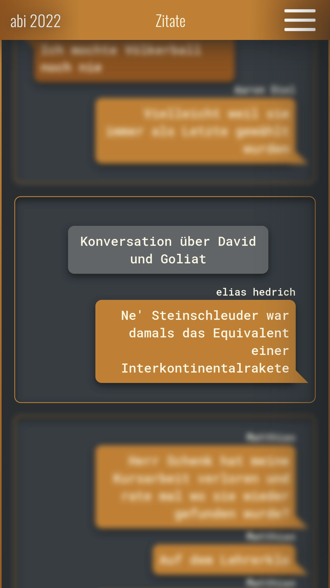

# abi 2022 website

a website for collecting images, quotes and hosting polls for my 2022
graduation

<section>
	
	
</section>

## installation and setup

```sh
# install dependencies
npm install
```

### for production

```sh
# compile scripts
npm run build

# start the server on port 1234
PORT=1234 npm run serve
```

additionally, a **abi-website.service** file is included for hosting the server
on a linux machine with *systemd*

**the port that will be used is specified in the service file, you need to
change it unless you want the server to run on port 1234**

simply copy the file to *~/.config/systemd/user* and run:

```sh
# start the server
systemctl --user start abi-website.service

# enable the server for automatic start on system boot
systemctl --user enable abi-website.service
```

note that you might have to run this command so that the process continues
when you log out.
```sh
loginctl enable-linger "$USER"
```

### for development

```sh
npm run dev
```
